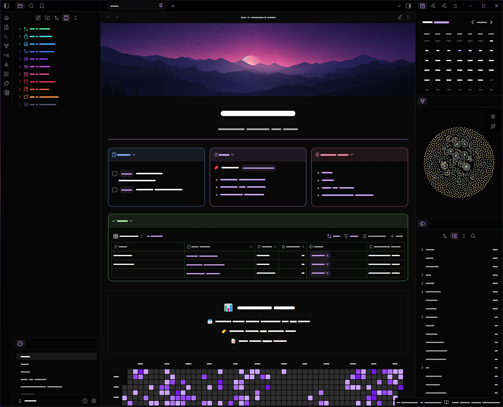

<h1 align="center">Obsidian Vault</h1>

### A Template for my Obsidian Vault.

This is a copy of my Obsidian Vault, scrubbed of personal information that you can use as a template or inspiration for your own vault.

Theme: **AnuPpuccin** with [extended-colorschemes](https://github.com/AnubisNekhet/AnuPpuccin/blob/main/snippets/extended-colorschemes.css) snippet.

<h1 align="center">🌟 Showcase 🌟</h1>

### Homepage
<div align="center">
    <a href="./Vault/01%20-%20stormy/Home.md" target="_blank">
        
    </a>
</div>

### Features
- Display unchecked ToDo's
- Easy access to your recent notes and tags
- Stats of your vault
- Heatmap of created files
### 📥 How to copy
#### 1. Download plugins
- Banners
- Widgets
- Calendar
- Dataview
- Homepage
- Contribution Graph
- Multi-Column Markdown
#### 2. Download snippets
- [dashboard](./.obsidian/snippets/dashboard.css)
- [hide-properties](./.obsidian/snippets/hide-properties.css)
- [MCL Multi Column](./.obsidian/snippets/MCL%20Multi%20Column.css)
#### ⚙3. setup
- Download my [homepage](./Vault/01%20-%20stormy/Home.md)
- Move a your Banner to [08 - Recources](./Vault/08%20-%20Recources/Purple_Sky.png)

**To showcase ToDo's**
- Change the tag in line `25,26,44` in [homepage](./Vault/01%20-%20stormy/Home.md) to your tag you want to be displayed
- Change the folder in line `43` in [homepage](./Vault/01%20-%20stormy/Home.md) to the folder where your projects are located

## 📂 Folder structure
```
├── 00 - Drafts # Unfinished notes or ideas
├── 01 - Private # Personal or sensitive content
├── 02 - Computer # Tech/configuration notes
├── 03 - Projects # Coding or creative projects
├── 04 - Work # Job, freelance, or applications
├── 05 - School # Study and school notes
├── 06 - Daily # Logs, routines, reflections
├── 07 - Archives # Old, unused content
├── 08 - Other # Miscellaneous topics
├── 09 - Recources # Useful links and materials
└── 99 - Templates # Note and doc templates
```

## ✨ Features

<h3 align="center">Obsidian-Colored-Sidebar</h3>
<div align="center">
    <a href="./.obsidian/snippets/colored-sidebar-items.css" target="_blank">
        
    </a>
</div>

Credits: [CyanVoxel](https://github.com/CyanVoxel/Obsidian-Colored-Sidebar)

<h3 align="center">Showcase blueprint</h3>
<div align="center">
    <a href="./.obsidian/snippets/notebook-backgrounds.css" target="_blank">
        
    </a>
</div>

<h3 align="center">Showcase daily note</h3>
<div align="center">
    <a href="./.obsidian/snippets/daily-note-theme.css" target="_blank">
        
    </a>
</div>

## 🚀 How to Use
1. Clone the repository:
```git clone https://github.com/stormyark/Obsidian-Vault.git```

2. Browse the docs folder for the topic you're interested in.

## 🤝 Contributions
If you'd like to contribute to this project, feel free to open a pull request or submit issues with suggestions and feedback.

## 📄 License
License can be found [here](https://github.com/stormyark/Obsidian-Vault/blob/main/LICENSE)
