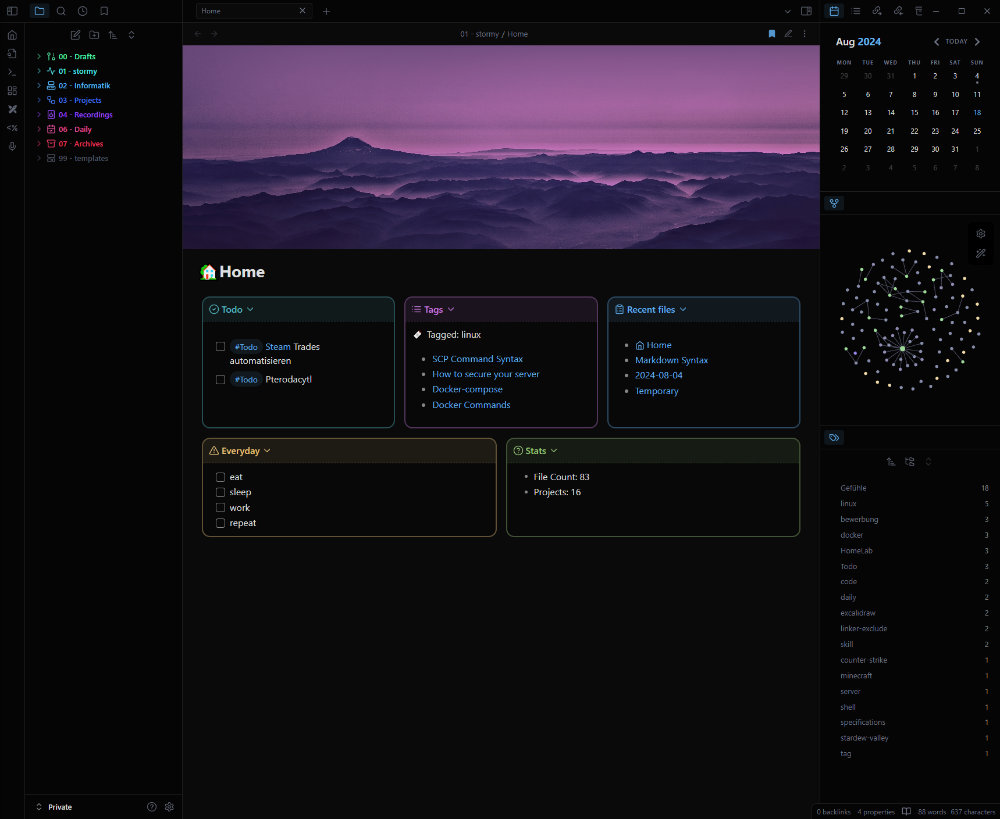

<h1 align="center">Obsidian-Vault</h1>

### A Template for my Obsidian Vault.

This is a copy of my Obsidian Vault, scrubbed of (most) personal information that you can use as a template or inspiration for your own vault.

To get a Theme like this use: **AnuPpuccin** with [extended color schemes snippet](./snippets/extended-colorschemes.css)

To create rainbowcolor folders use [this](./snippets/Colored Sidebar Items.css)

To create a dashboard like this install the plugin [dataview](https://github.com/blacksmithgu/obsidian-dataview) and copy the [dashboard-css](./snippets/dashboard.css), [hide-properties.css](./snippets/hide-properties.css), [Multi column](./snippets/MCLMultiColumn.css) and use [home.md](./Vault/01 - stormy/Home.md)

## Showcase

## Showcase daily note

