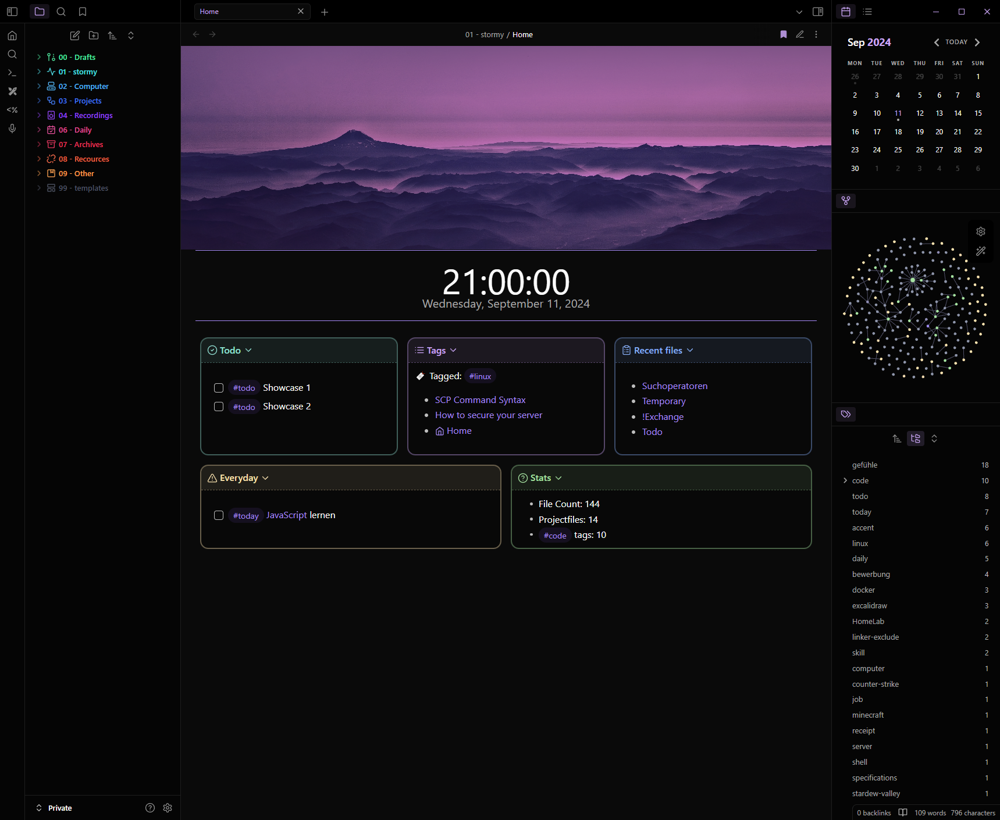
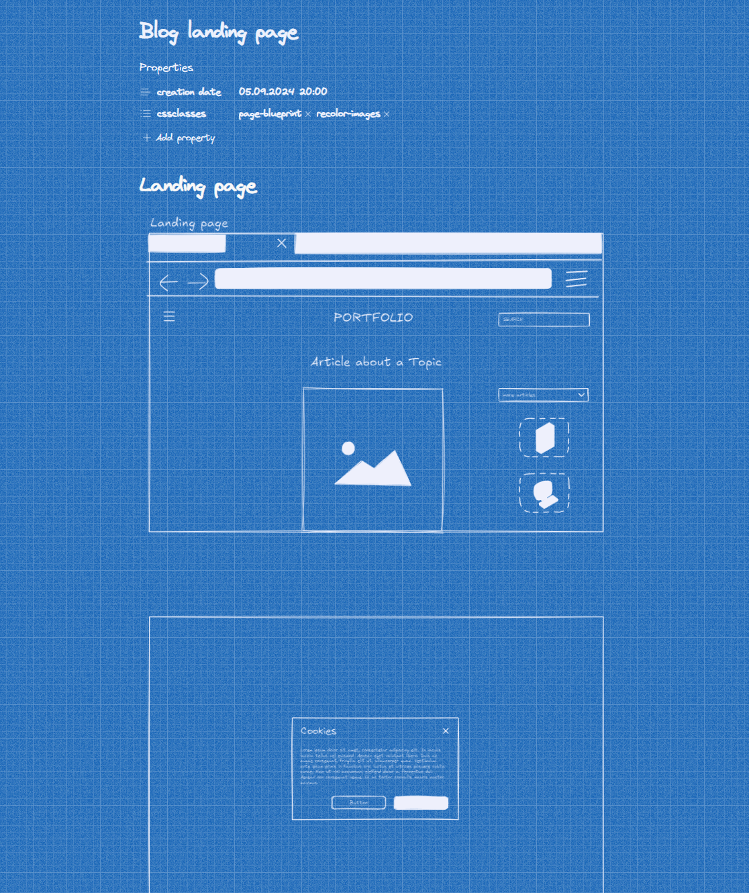
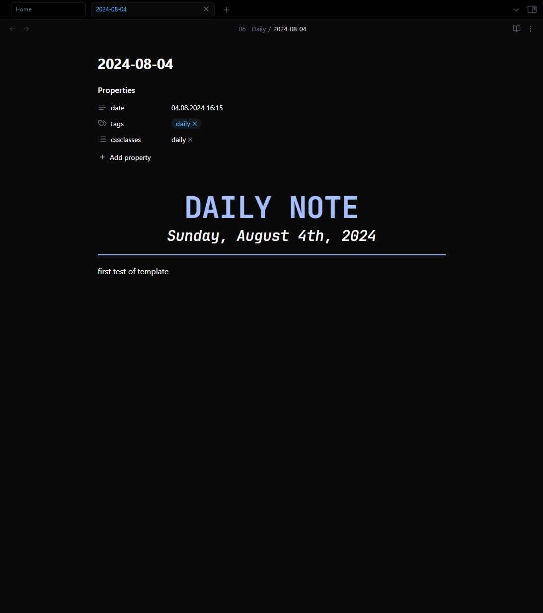
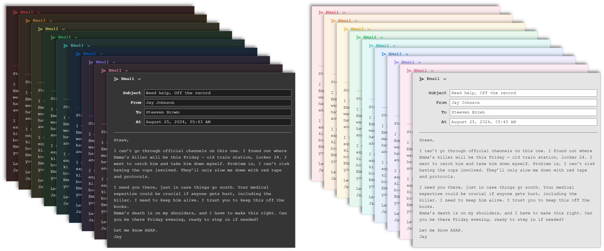
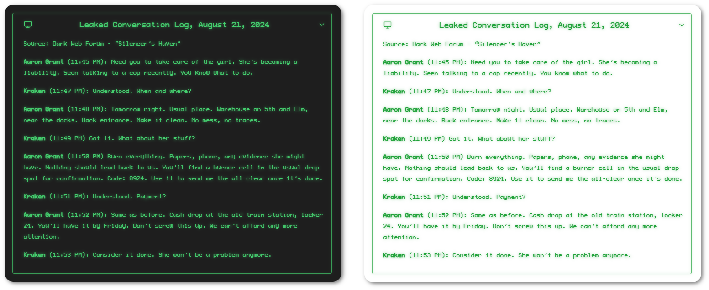
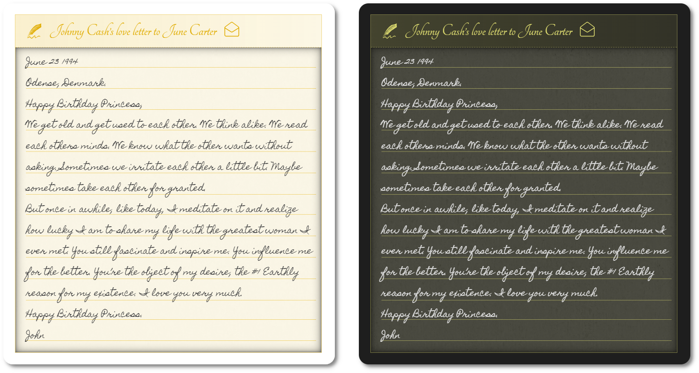
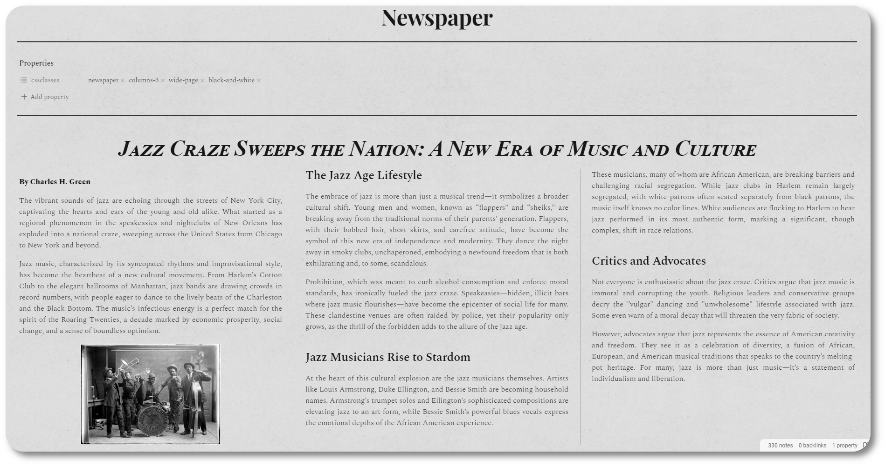

<h1 align="center">Obsidian-Vault</h1>

 
### A Template for my Obsidian Vault.

This is a copy of my Obsidian Vault, scrubbed of (most) personal information that you can use as a template or inspiration for your own vault.

Theme: **AnuPpuccin** with [extended color schemes snippet](./.obsidian/snippets/extended-colorschemes.css).

<h1 align="center">Showcase</h1>

## Homepage

## Showcase blueprint

    

## Showcase daily note

    

## Callouts
### Email

### Screen

### Letter

## Other
### Newspaper

