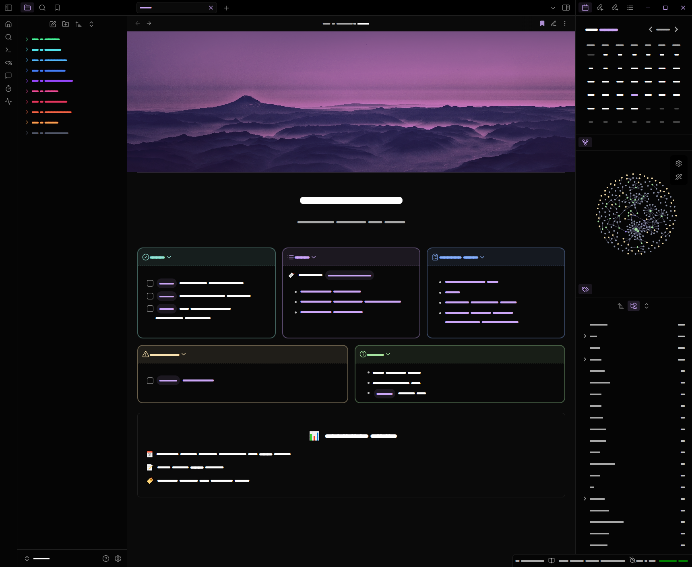

<h1 align="center">Obsidian-Vault</h1>

  

### A Template for my Obsidian Vault.

This is a copy of my Obsidian Vault, scrubbed of (most) personal information that you can use as a template or inspiration for your own vault.

Theme: **AnuPpuccin** with [extended color schemes snippet](./.obsidian/snippets/extended-colorschemes.css).

<h1 align="center">Showcase</h1>

## Homepage

    

[showcase with data](./Vault/showcase/showcase_v6.png).

## Showcase blueprint

    

## Showcase daily note

    

## Other
### Newspaper

